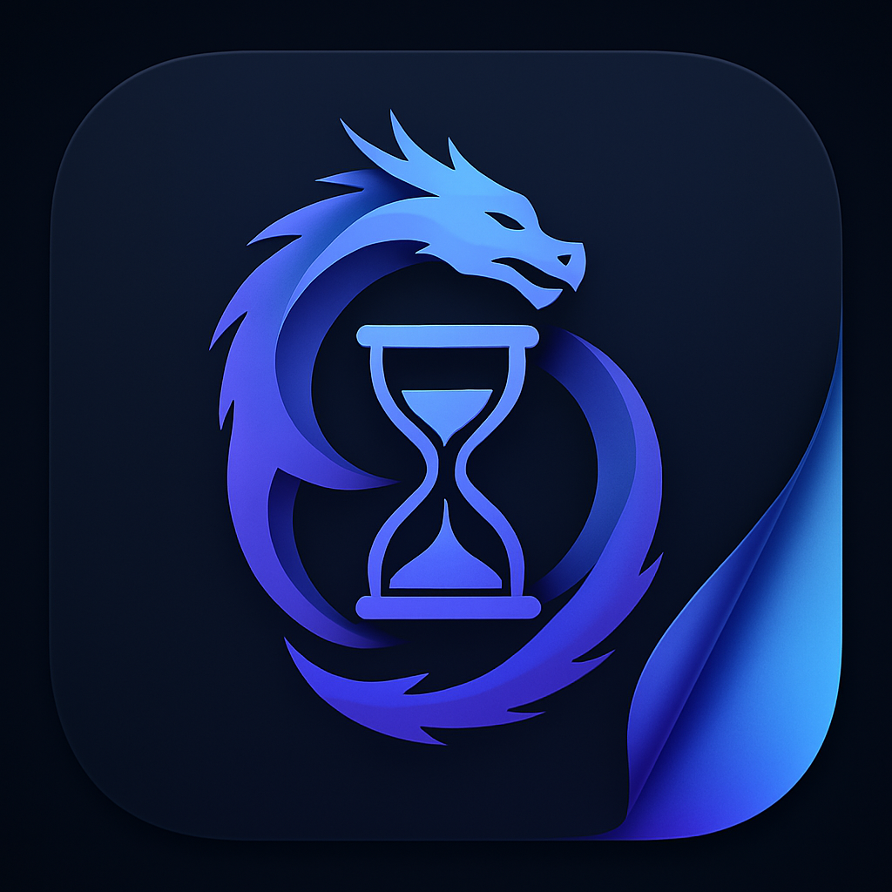
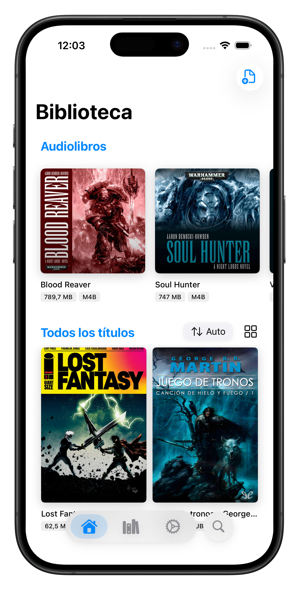
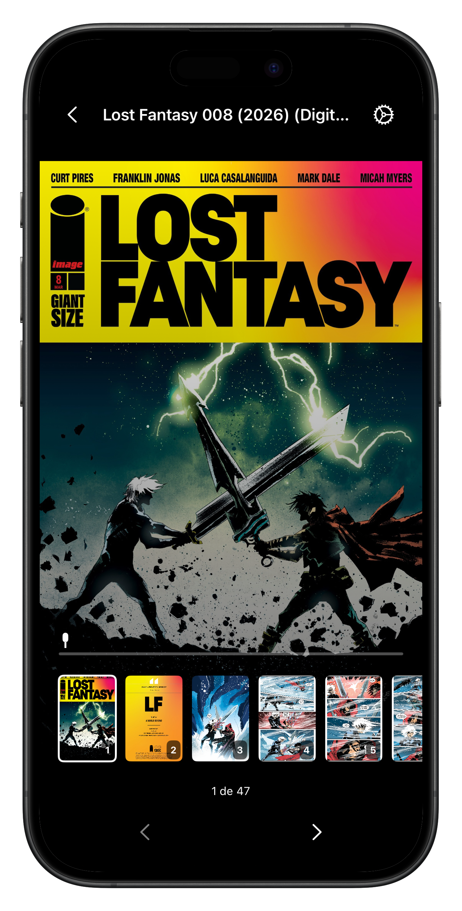
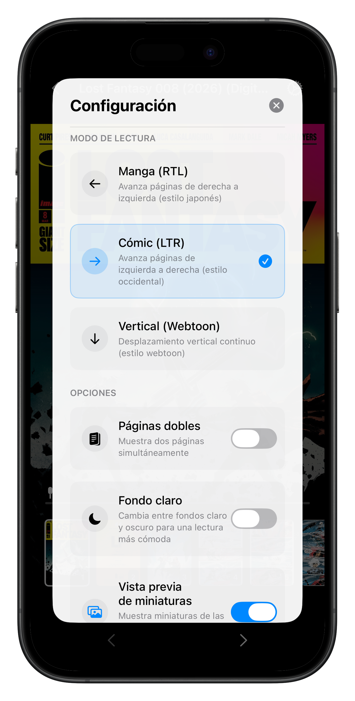
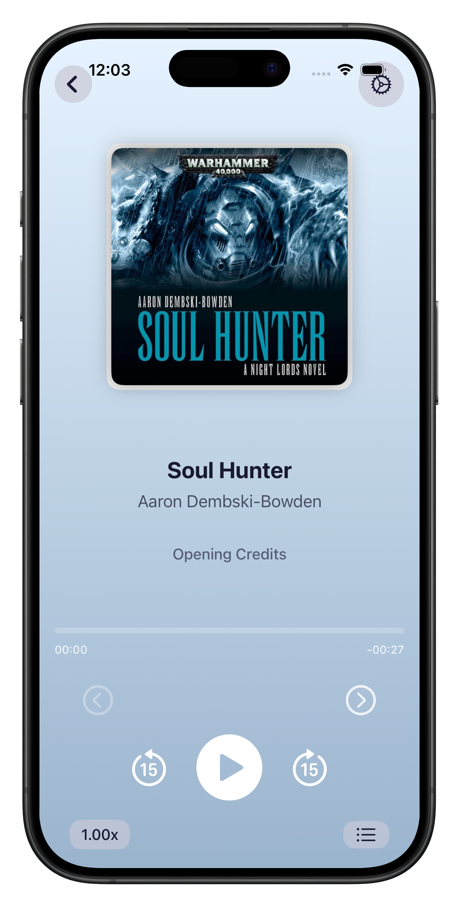
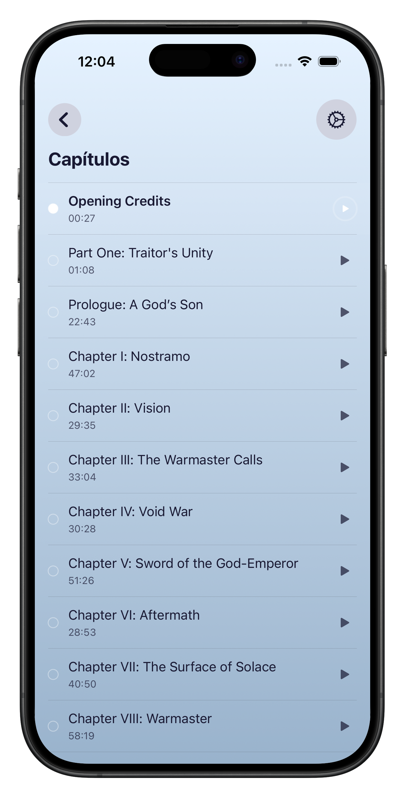
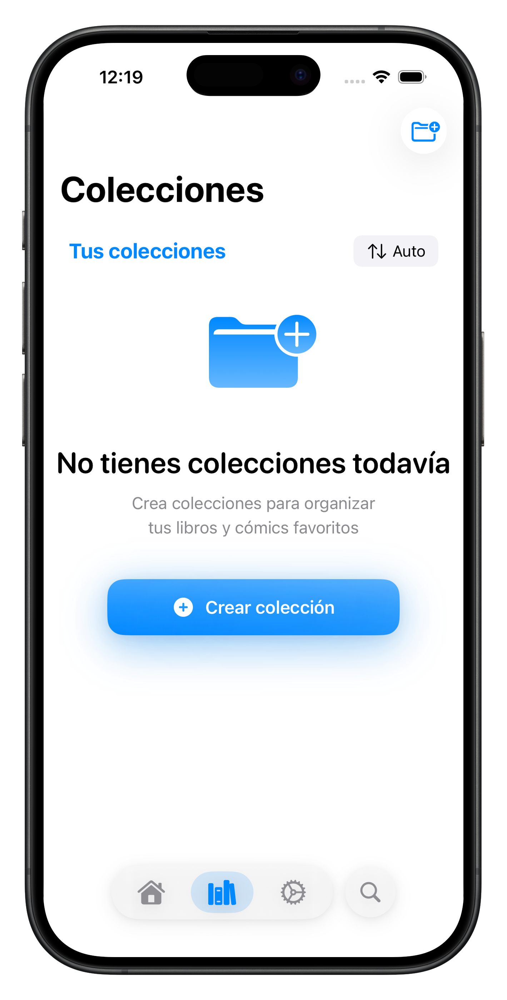
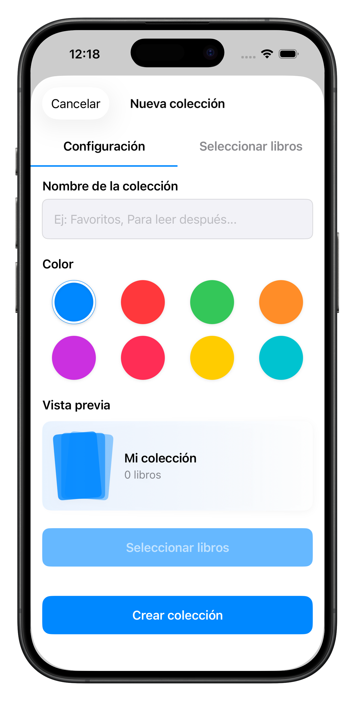

<div align="center">



# Chrono Reader

**A personal iOS reading & listening app for comics, audiobooks and EPUBs.**


> ⚠️ **This project is not 100% finished.** The comic reader and audiobook player are fully functional. The EPUB reader and some secondary features are still being polished.

</div>

---

## Screenshots

<div align="center">

### Library & Home



### Comic Reader

  

### Audiobook Player

  

### Collections

  

</div>

---

## Features

| Feature | Status |
|---|---|
| 📚 Local library (CBZ, CBR, M4B, EPUB) | ✅ Done |
| 🎨 Comic reader (LTR / RTL / Webtoon) | ✅ Fully functional |
| 🎧 Audiobook player with chapters | ✅ Fully functional |
| 🗂️ Custom collections with color tags | ✅ Done |
| 🔖 Reading progress persistence | ✅ Done |
| 🔍 Search across the library | ✅ Done |
| 📖 EPUB reader | 🚧 In progress |
| 🌙 Dark / Light / System theme | ✅ Done |
| 🎵 Background audio playback (Lock Screen controls) | ✅ Done |
| 📄 PDF reader | 🔜 Planned |

---

## Comic Reader

The comic reader (`EnhancedComicViewer`) is a hybrid **SwiftUI + UIKit** component offering:

- **Three reading modes:** Comic LTR, Manga RTL, Vertical Webtoon
- **Double page layout** support (landscape)
- **Smooth page transitions** with per-book settings
- **Advanced zoom:** double-tap to zoom on a specific point, pinch, pan
- **Thumbnail scrubber** for quick navigation
- Supports **CBZ** (ZIP) and **CBR** (RAR) archives

---

## Audiobook Player

The audiobook player (`AudioPlayerView`) is built on top of **AVFoundation** and supports:

- **M4B** files with embedded chapters
- Lock Screen & Control Center playback controls via **MediaPlayer** framework
- **Background playback** (requires Background Modes capability — see [`Docs/Audio/BackgroundPlaybackConfig.md`](Docs/Audio/BackgroundPlaybackConfig.md))
- Skip forward / backward 15 seconds
- Variable playback speed
- Per-book position persistence

---

## Tech Stack

| Layer | Technology |
|---|---|
| Language | Swift 5.9 |
| UI | SwiftUI (with UIKit for the comic viewer) |
| Concurrency | `async/await` + Combine |
| Audio | AVFoundation + MediaPlayer |
| EPUB rendering | WebKit (`WKWebView`) |
| ZIP archives | [ZIPFoundation](https://github.com/weichsel/ZIPFoundation) `0.9.19` |
| XML parsing | [XMLCoder](https://github.com/CoreOffice/XMLCoder) `0.17.1` |
| RAR archives | [Unrar.swift](https://github.com/nickvdyck/unrar.swift) `0.4.1` |

---

## Architecture

The app follows a feature-based layered structure:

```
App/                    # Entry point, AppDelegate, lifecycle
Models/                 # Domain models (Book, Collection, ProgressMarker, EPUB)
Services/               # Business logic (archive parsing, audio, EPUB, metadata)
Utils/                  # Shared utilities (ImageCache)
Views/
  AppShell/             # Tab navigation shell
  Features/
    Home/               # Library, import, search
    Comic/              # Comic viewer (CBZ/CBR)
    Audio/              # Audiobook player (M4B)
    EPUB/               # EPUB reader
    Collections/        # Custom collections
  Shared/               # Reusable UI components
```

**Persistence:** `UserDefaults` for books, collections, progress and settings. Files are copied to the app's `Documents/` directory with a UUID prefix.

---

## Project Setup

1. Clone the repo and open `chrono-reader.xcodeproj` in **Xcode 15+**.
2. Select your development team in *Signing & Capabilities*.
3. To enable background audio, add the **Background Modes** capability and check *Audio, AirPlay, and Picture in Picture* (see [`Docs/Audio/BackgroundPlaybackConfig.md`](Docs/Audio/BackgroundPlaybackConfig.md)).
4. Build and run on a device or simulator running **iOS 16+**.

> **Note:** If you move files around, make sure to re-link them in the Xcode target membership.

---

## Roadmap

- [ ] EPUB reader — finish pagination and TOC navigation
- [ ] PDF reader
- [ ] iCloud / Files app sync
- [ ] iPad optimized layout
- [ ] App Store release

---

<div align="center">
Made with ❤️ using SwiftUI
</div>
